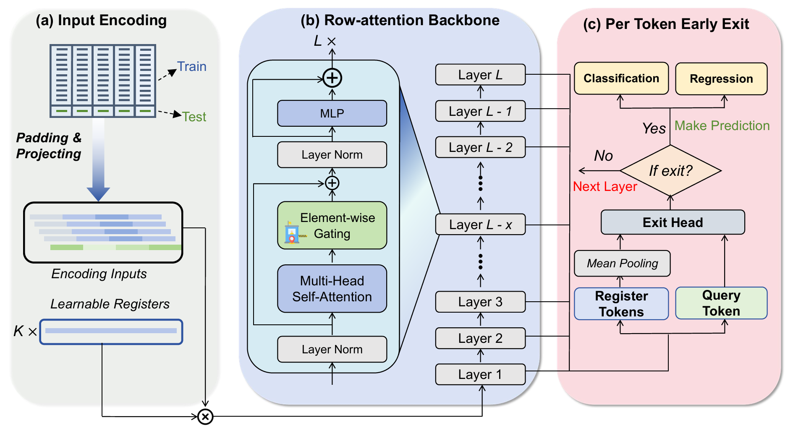

# TabSwift: An Efficient Tabular Foundation Model with Row-Wise Attention

TabSwift is a tabular foundation model based on in-context learning (ICL). Given a set of labeled training samples, TabSwift makes predictions on test samples directly through forward inference — no fine-tuning required. The model jointly supports classification and regression tasks with a single pre-trained checkpoint.


---

## Method

### Architecture Overview

TabSwift processes a tabular dataset as a sequence of rows. Each row is a sample whose features are first padded to a fixed dimension and projected into an embedding space. The core of TabSwift is a Transformer-based in-context learning module that takes both training rows (with label embeddings injected) and test rows as input, and outputs predictions for the test rows.

The architecture consists of three key components:

#### 1. Row-Wise Attention

Unlike column-wise approaches that embed features independently, TabSwift models each row as a single token and applies attention across rows. This row-wise design naturally captures feature interactions within each sample and enables the model to learn how rows relate to each other in the context of the entire dataset.

During in-context learning, a specialized **split attention pattern** is used:
- Training rows (with their label embeddings added) attend to each other via self-attention.
- Test rows attend to all training rows but **not** to each other.

This ensures that predictions for each test sample are conditioned solely on the labeled examples, following the in-context learning paradigm.

#### 2. Gated Attention

TabSwift introduces a **gated attention** mechanism that applies a learned gate to the output of each attention head. Two gating variants are supported:

- **Head-wise gating**: A single scalar gate per attention head, allowing the model to selectively amplify or suppress entire heads.
- **Element-wise gating**: A per-element gate within each head, providing finer-grained control over the attention output.

The gate is computed as `sigmoid(W_gate · x)` and multiplied element-wise with the attention output before the final projection. This mechanism allows the model to dynamically modulate information flow across layers.

#### 3. Register Tokens

TabSwift prepends a set of **learnable register tokens** to the input sequence of the ICL Transformer. These tokens:

- Provide additional capacity for storing dataset-level information without interfering with the data tokens.
- Are discarded after the final Transformer layer — only the data token positions are decoded into predictions.

#### Dual Task Heads

TabSwift maintains separate decoder heads for classification and regression within the same model:

- **Classification head**: `Linear → GELU → Linear(max_classes)` — outputs logits over a fixed number of classes.
- **Regression head**: `Linear → GELU → Linear(1)` — outputs a scalar prediction.

At inference time, the appropriate head is selected based on the task type. This allows a **single pre-trained checkpoint** (`swift.ckpt`) to serve both classification and regression tasks.

<p align="center">
  
</p>


### Training

TabSwift is pre-trained on a large collection of synthetic tabular datasets generated on-the-fly. The training objective is standard in-context learning: given a subset of labeled rows from a synthetic dataset, predict the labels of the remaining rows. Both classification and regression tasks are included in the pre-training mixture, enabling the shared backbone to learn transferable tabular representations.

---

## Pre-trained Checkpoint

The pre-trained model weights are distributed as a single checkpoint file `swift.ckpt`, which supports both classification and regression. 

The checkpoint will be automatically downloaded from 🤗 **[LAMDA-Tabular/TabSwift](https://huggingface.co/LAMDA-Tabular/TabSwift)** on first use, or you can specify a local path manually.

---

## Quick Start

### Using the TALENT Pipeline

The inference code is adapted from the TabICL framework, integrated into the TALENT benchmark pipeline.

```bash
# Download the checkpoint (or let it auto-download on first run)
# Then evaluate on a dataset:
python train_model_deep.py \
    --pretrain_model_path swift.ckpt \
    --cat_policy indices \
    --normalization none \
    --seed_num 5 \
    --gpu 0 \
    --dataset Pima_Indians_Diabetes_Database \
    --dataset_path ../data
```

Or use the provided shell script:

```bash
bash test.sh
```

### Using the Python API (sklearn-compatible)

```python
from TALENT.model.lib.tabswift.classifier import TabSwiftClassifier
from TALENT.model.lib.tabswift.regressor import TabSwiftRegressor

# Classification
clf = TabSwiftClassifier(
    model_path="swift.ckpt",   # path to the shared checkpoint
    n_estimators=16,
    device="cuda",
)
clf.fit(X_train, y_train)
preds = clf.predict(X_test)

# Regression
reg = TabSwiftRegressor(
    model_path="swift.ckpt",   # same checkpoint
    n_estimators=16,
    device="cuda",
)
reg.fit(X_train, y_train)
preds = reg.predict(X_test)
```

---

## Project Structure

```
TabSwift/
├── README.md
├── train_model_deep.py              # TALENT pipeline entry point
├── test.sh                          # Example evaluation script
├── resources/
│   └── TabSwift.png                 # Architecture diagram
└── TALENT/
    └── model/
        ├── lib/tabswift/
        │   ├── classifier.py        # TabSwiftClassifier (sklearn-compatible)
        │   ├── regressor.py         # TabSwiftRegressor
        │   ├── preprocessing.py     # Data transformation & ensemble generation
        │   └── model/
        │       ├── tabswift.py      # Core model
        │       ├── learning.py      # ICLearning (Transformer + hierarchical classification)
        │       ├── encoders.py      # Multi-block attention encoder with register tokens
        │       ├── attention.py     # Gated attention + split attention pattern
        │       ├── layers.py        # Attention blocks, FFN, ClassNode
        │       └── inference.py     # Inference batching & memory management
        ├── methods/tabswift.py      # TALENT Method adapter
        └── configs/default/tabswift.json
```

---

## Citation

```bibtex
@inproceedings{LiuTabSwift2026,
  title={TabSwift: An Efficient Tabular Foundation Model with Row-Wise Attention},
  author={Si-Yang Liu and Han-Jia Ye},
  year={2026},
  booktitle={ICML},
}
```

## Acknowledgements
We gratefully acknowledge the **TabICL** and **TALENT** framework.
